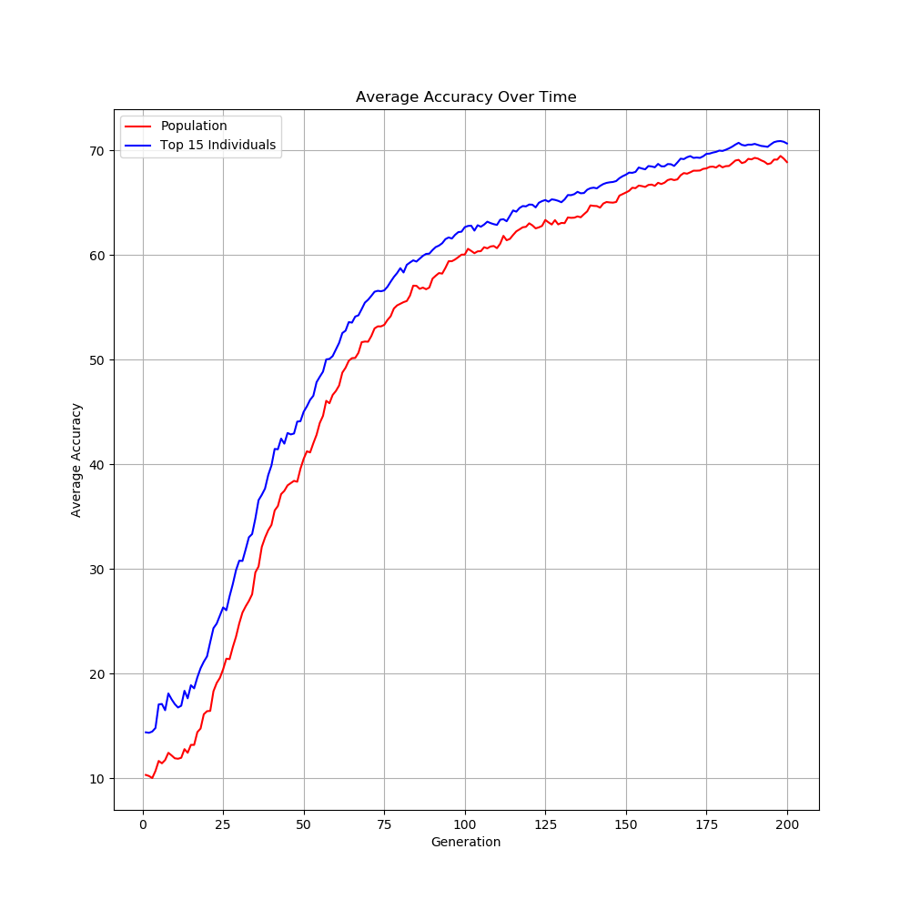

# Genetic Algorithms in Neural Networks

---

**Contributors**: Shubham Jain, Michael Lee, Jeremy Meyer

## Project Overview 

With this project we aim to explore the applications of genetic algorithms and reinforcement learning in the context of learning how to play games. Our ultimate goal is to develop a network capable of playing PacMan by using game data, such as player position, wall positions, and directional vectors towards ghosts, fruits, and orbs to learn an optimal strategy of movement. Our first steps towards this goal is to use a genetic algorithm to optimize the weights of an artificial neural network for MNIST digit classification, then develop a convolutional neural network capable of playing Pong by utilizing reinforcement learning. We will then try to combine what we've learned from these smaller experiments to implement a network to play PacMan.

## Genetic Algorithm MNIST Classifier

We used Keras to develop a simple artificial neural network, but instead of compiling with a typical backpropagation/gradient descent style optimizer, we apply our own method of weight optimization. A high level overview of our pipeline is as follows:

1. Construct an initial population of networks with randomly initialized weights and biases.
2. Use the training data to immediately make predictions using each network in the population.
3. Rate each population's fitness using its training accuracy.
4. Select the top individuals of this population to create a mating pool.
5. Randomly select parents from this mating pool to perform crossover and produce sets of weights and biases for the next generation of networks.
6. For each new network, randomly select weights and biases to mutate.
7. Repeat steps 2-6 for a large number of generations.

We have the following hyperparameters:

1. `NUM_GENERATIONS`: the number of generations to continue this process
2. `POPULATION_SIZE`: the number of networks in each population
3. `SELECTION_SIZE`: the size of the mating pool
4. `MUTATION_RATE`: the probability that a weight is mutated during crossover
5. `MUTATION_WEIGHT_RANGE`: the range of values that a weight could be modified by
6. `MUTATION_BIAS_RANGE`: the range of values that a bias could be modified by
7. Crossover method: could be either uniform crossover or single-point crossover

We used the following network architecture for each individual in the population:

```
Model: "sequential_1"
_________________________________________________________________
Layer (type)                 Output Shape              Param #   
=================================================================
dense_0 (Dense)              (None, 784)               615440    
_________________________________________________________________
dense_1 (Dense)              (None, 32)                25120     
_________________________________________________________________
dense_2 (Dense)              (None, 10)                330       
=================================================================
Total params: 640,890
Trainable params: 640,890
Non-trainable params: 0
_________________________________________________________________
```

An example of the learning curve of this process:



## Reinforcement Learning Pong Player