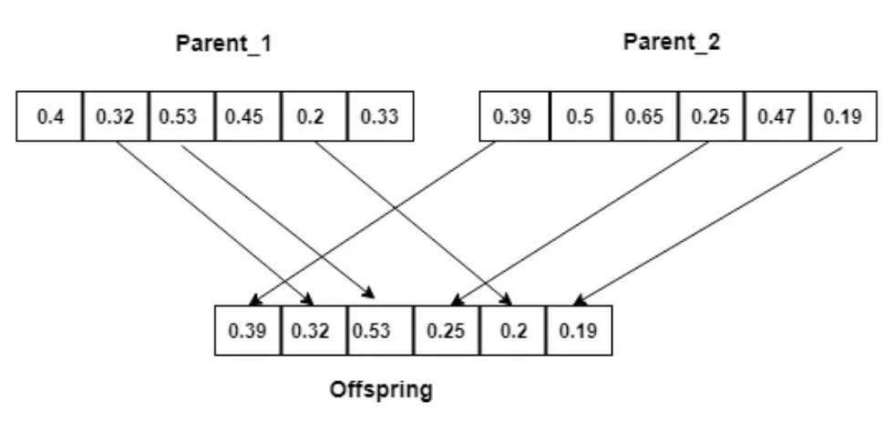
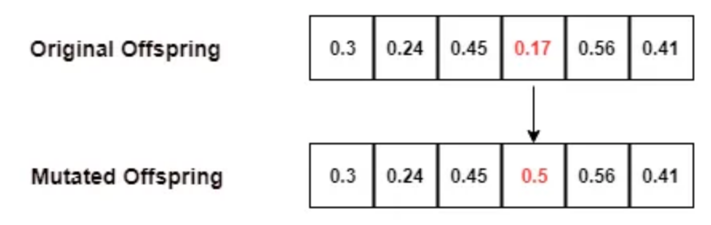

# Genetic Algorithms

---

## Index

1. [Introduction](#introduction)
2. [How it Works](#how-it-works)
3. [Common Problems](#common-problems)
4. [Potential Project Ideas](#project-ideas)
5. [Resources](#resources)

---

## Introduction 

Genetic algorithms are a type of learning algorithm that is founded on the idea that crossing over the weights of two good neural networks should result in a better neural network.

##### Basic Intuition

* Sort of mimicking evolution
  * Produce a basis for "natural selection"
    * A population of networks is generated, all of which are competing against each other
  * Spread the genes of high-performing networks
    * Also sprinkle in some random mutations
  * Produce "generations" of the network, with the hope that each generation takes the good qualities of its ancestors and improves them, then spreads them to its descendants

##### General Idea of Implementation

* A set of random weights are generated
  * This network is called the "first agent"
* A set of tests are performed on the agent, and is scored
* Repeat this several times to create a population
* Select s subset of high performing agents in this population to be used for crossover
  * Every time there is a crossover, there is a small chance of **mutation**, that is, a random value that is in neither of the parent's weights
* Continually repeat this process

##### Pros:

* Relatively computationally inexpensive
  * No linear algebra of back-propagation
* Adaptable
  * Genetic algorithms can be applied to many different problems (classifiers, GANs, AI)

##### Cons:

* Takes a long period of time
  * Unlucky crossovers and mutations can worsen the network's performance and make it harder to reach convergence. However, these mutations could also potentially improve the network

---

## How it Works 

### Hyperparameters

1. Population size, number of generations
2. Fitness function
3. Selection process
4. Crossover process
5. Mutation process/rate

### Initial Population

At the start of the algorithm, we randomly initialize the first population. Every population represents a set of possible solutions to our problem — for neural networks, that typically means a set of weights.

* The size of the population at each generation is a hyperparameter
* Each member of the population is sometimes referred to as a chromosome, and represents a single possible solution to the problem

### Evaluation

Given a population, we want to evaluate the fitness of each individual member. The fitness function itself is another hyperparameter.

* The fitness function provides a metric that measures the quality of an individual
  * Examples could include distance, some sort of score, accuracy, etc.

### Selection

After the individuals have been scored, we select a subset of them to form the basis for the creation of the next generation of individuals.

* The selection process can be considered a hyperparameter
* We could use something like weighted selection, which randomly selects individuals from the parent population while giving higher chance of selection to individuals with higher fitness

### Crossover

Once we have selected the "most fit" individuals from the parent population, we produce "offspring" by taking attributes from pairs of parents and merging them together

* The crossover process is another hyperparameter

  
  
* **Types of Crossover Methods**

  * Single Point Crossover: a partition point/index is chosen in an individual's attributes. Everything before that partition is copied directly to the child, while everything after is taken from the other parent. Do this again, but swapping which side is copied. Thus each SPC crossover produces two children that mirror each other
  * Two Point Crossover: two partition points/indexes are chosen, and the same process is applied as above.
  * Uniform Crossover: attributes from each parent are randomly selected to make it into the child. Can be implemented to produce two children with each crossover, where the two children are mirrors of each other.

### Mutation

In order to maintain diversity within the population, we add some variation into the next generation with what is basically statistical noise. We randomly select certain individuals with a typically small probability, then randomly select features to change, again with typically small probability.

* Mutation rate is also a hyperparameter

  

### Evolution

Continue this process of forming a population, evaluating its fitness, selecting parents, then spawning new generations.

---

## Common Problems 

### Poor Convergence (Stuck at Local Extrema)

* Network gets stuck at a poor solution and does not change
  * This can happen if the population size of each generation is too small (low genetic diversity)
  * This can also happen if there is no mutation to each generation
    * Adding a mutation chance will help explore more of the solution space

### Lack of Convergence

* Network does not converge at all or takes an unpractical time to reach convergence
  * May be too much mutation happening

---

## Potential Project Ideas 

* Snake game (there is a fully coded example online so probably not exactly this)
* Wifi dinosaur game
* Pacman
* Pong

---

## Resources

* Introduction to Genetic Algorithms and General Intuition
  * https://towardsdatascience.com/using-genetic-algorithms-to-train-neural-networks-b5ffe0d51321
  * https://www.youtube.com/watch?v=XP8R0yzAbdo
  * https://theailearner.com/2018/11/08/genetic-algorithm-and-its-usage-in-neural-network/
* Crossover Methods
  * https://www.geeksforgeeks.org/crossover-in-genetic-algorithm/
* Genetic Neural Network to play Snake
  * https://theailearner.com/2018/11/09/snake-game-with-genetic-algorithm/
* Fully programmed PacMan in python
  * https://github.com/greyblue9/pacman-python
* Fully programmed Pong in python
  * https://github.com/macko358/PygamePong
